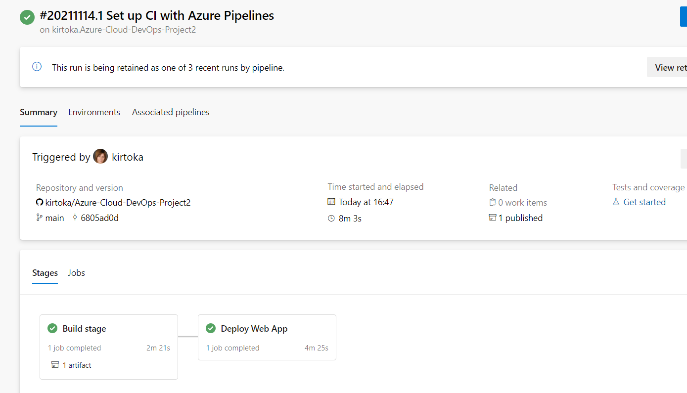

[](https://github.com/kirtoka/Azure-Cloud-DevOps-Project2/actions/workflows/pythonapp.yml)
[](https://dev.azure.com/VeraChirtoca/Flask-ML-Deploy/_build/latest?definitionId=2&branchName=main)
[](https://opensource.org/licenses/MIT)


## 🌻 Overview
This is the Project #2 of the the UDACITY Nanodegree "Cloud DevOps using Microsoft Azure" provides integration Python Flask app to predict housing prices with Azure Pipelines to enable Continuous Delivery to Azure App Service.

## 💼 Project Plan
* Preparation:
    - A link to a [Trello Board](https://trello.com/b/HPLTx4cX/project2) board for the project 
    - A link to a [spreadsheet](https://docs.google.com/spreadsheets/d/1w6LxbBvQFOybaVchvDr1peQVxrUASt26_UQUmS6g8_E/edit#gid=1348135932) that includes the original and final project plan 
* CI: Set Up Azure Cloud Shell
* CI: Configure GitHub Actions
* Continuous Delivery on Azure
* Test and Demo

## ⛳ Instructions
Architecture Diagram


### Set Up Azure Cloud Shell
1. Generate ssh key in Azure CLI by command `ssh-keygen -t rsa`, after that `cat /home/vera/.ssh/id_rsa.pub`
we have to copy result to github Settings-> Deploy Keys


2. Clone git repo by using ssh key


3. Create a python Virtual Environment `python3 -m venv ~/.{your-project}` After that `source ~/.{your-project}/bin/activate`

4. Next you need to change directory to the repo name


5. Run a `make all` - this will install the required modules from the requirements.txt file. It will next run the linting step to lint our code and look for any formating and syntax errors as python is an interpreted language. After the linting it will run the testing scripts to test our code. At the end of the command you should be greated by the linting steps and the tests being passed.


6. Create the resource group `az group create -l eastus2 -n "udcaity-project2-rg"` 

7. To create the web app we run this command `az webapp up --sku F1 -l eastus2 -g "udcaity-project2-rg" -n "flask-ml-project2-app"` 

### CI: Configure GitHub Actions
Now we have to create configuration file for CI by chosing in GitHub Action->setup a workflow yourself and paste next code 
```
name: Python application test with Github Actions
on: [push]
jobs:
  build:

    runs-on: ubuntu-latest

    steps:
    - uses: actions/checkout@v2
    - name: Set up Python 3.8
      uses: actions/setup-python@v1
      with:
        python-version: 3.8
    - name: Install dependencies
      run: |
        make install
    - name: Lint with pylint
      run: |
        make lint
    - name: Test with pytest
      run: |
        make test
```


### Continuous Delivery on Azure
Now we can configure CD on Azure:
 * Open dev.azure.com;
 * Create Pipeline in Azure Pipilenes
 * Autorize App service  
 * Check yml config file into GitHub
 * Deploy WebApp in Azure Pipelines
 
 

### Test
 You can go to your web app through the Azure Portal interface by going to your app and find the URL here. 
 
 
 If you would like to run the tests during your development you can run the tests using the `pytest` command this will run all files that have the `test_` file naming convention.

 Now you can go to your cloud shell again and change the "make_predict_azure_app.sh". After that you can run script `./make_predict_azure_app.sh`
 

 If you would to check the logs of your application you can see them using this command should see something like this below. `az webapp log tail -g "{resource-group-name}" -n "{app-name}"`
 


## Enhancements

Better Tests in the Testing scripts

## Demo 

https://youtu.be/E0NWXTZvXdA


